# Sistema de Navegação Vibrotátil

Repositório contendo o código-fonte, os arquivos de simulação e registros do
processo de desenvolvimento utilizados no Trabalho de Conclusão de Curso em
Engenharia da Computação.

O projeto apresenta uma prova de conceito de um sistema de navegação
vibrotátil voltado ao auxílio da mobilidade de pessoas com deficiência visual.
A solução integra uma aplicação Android, comunicação Bluetooth Low Energy
(BLE), uma ESP32 e uma lógica de acionamento destinada à geração de feedback
vibrotátil direcional.

## Visão geral da arquitetura

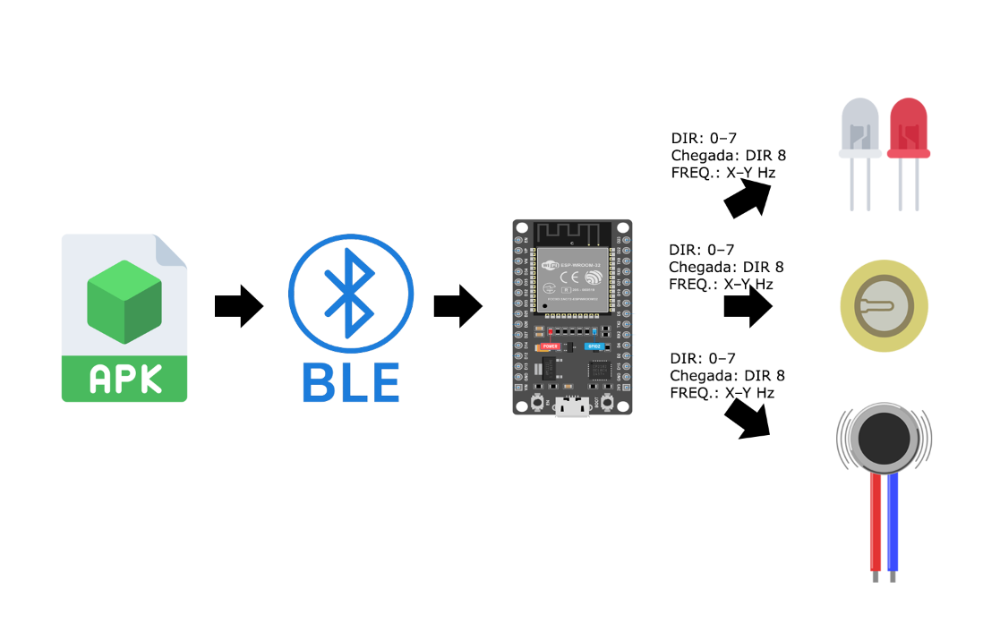

A aplicação móvel processa informações de localização, direção e distância.
Os parâmetros de navegação são enviados à ESP32 por BLE, que interpreta os
comandos recebidos e controla as saídas associadas ao feedback do sistema.

Durante o desenvolvimento, a lógica de acionamento foi avaliada inicialmente
com LEDs e, posteriormente, com atuadores piezoelétricos e motores vibratórios.

## Estrutura do repositório

- `aplicativo-android/` — código-fonte da aplicação móvel Android.
- `firmware-esp32/` — firmware desenvolvido para a ESP32.
- `documentacao/figuras/` — imagens e registros das etapas de desenvolvimento.
- `documentacao/simulacoes/wokwi/` — arquivos e documentação da simulação no Wokwi.
- `documentacao/simulacoes/proteus/` — arquivo e documentação da simulação no Proteus.

## Aplicativo Android

A aplicação móvel foi desenvolvida em Kotlin e é responsável pela obtenção e
processamento das informações de localização e navegação.

Entre as principais funcionalidades implementadas estão:

- integração com serviços do Google Maps;
- obtenção da localização do dispositivo;
- processamento da direção e da distância até o destino;
- representação das oito direções utilizadas pelo sistema;
- comunicação com a ESP32 por Bluetooth Low Energy (BLE);
- envio da direção e da frequência de repetição dos pulsos ao sistema embarcado.

### Interface consolidada da aplicação

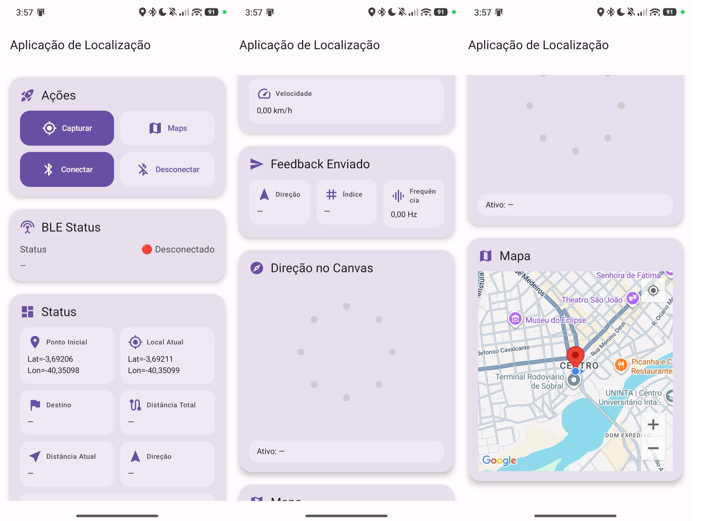

### Representação das oito direções

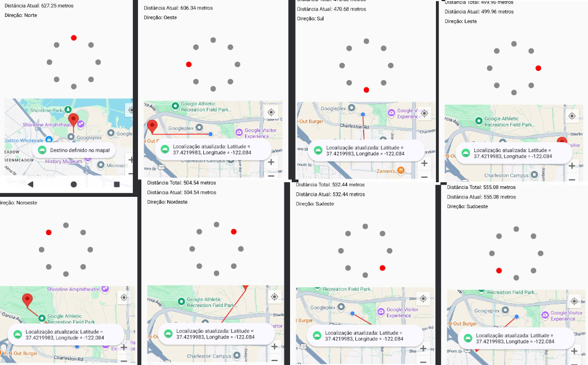

A interface utiliza oito posições para representar Norte, Nordeste, Leste,
Sudeste, Sul, Sudoeste, Oeste e Noroeste. A direção calculada é destacada
visualmente no aplicativo e convertida em um comando enviado à ESP32.

### Cálculo de distância e direção

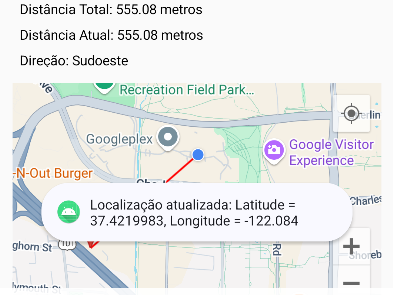

Os testes da aplicação permitiram verificar o cálculo da distância até o
destino e a determinação das direções utilizadas pela lógica de navegação.

### Comunicação BLE

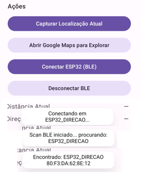

A comunicação BLE foi utilizada para transmitir os parâmetros calculados pela
aplicação para a ESP32.

### Ambiente utilizado

- Kotlin 1.9.0
- Android Studio Koala 2024.1.1 Patch 2
- Android Gradle Plugin 8.5.2
- Gradle 8.11
- JDK 17.0.13

## Configuração do Google Maps

Por motivos de segurança, a chave utilizada durante o desenvolvimento não é
disponibilizada neste repositório.

Antes de executar o aplicativo, substitua o valor:

`SUA_CHAVE_GOOGLE_MAPS_AQUI`

presente no arquivo:

`aplicativo-android/app/src/main/res/values/strings.xml`

por uma chave válida da Google Maps Platform.

## Compilação do aplicativo

Na pasta `aplicativo-android`, execute:

```powershell
.\gradlew.bat assembleDebug
```

O projeto foi verificado utilizando o Gradle Wrapper 8.11.

## Firmware ESP32

O firmware do sistema embarcado foi desenvolvido em C++ utilizando o Arduino
Framework e o PlatformIO.

O código implementa:

- servidor BLE na ESP32;
- recepção dos comandos enviados pela aplicação Android;
- interpretação da direção de navegação;
- controle das saídas correspondentes às direções;
- controle da frequência de repetição dos pulsos;
- lógica de acionamento destinada aos atuadores vibrotáteis.

### Ambiente utilizado

- ESP32
- C++
- Arduino Framework
- Visual Studio Code
- PlatformIO

A configuração do projeto está disponível em:

`firmware-esp32/platformio.ini`

## Compilação do firmware

Na pasta `firmware-esp32`, execute:

```powershell
pio run
```

Durante a preparação deste repositório, o firmware foi compilado com sucesso
para o ambiente `esp32dev`.

## Simulações

As simulações foram utilizadas como etapas intermediárias do desenvolvimento,
antes e durante a montagem física da prova de conceito.

### Simulação no Wokwi

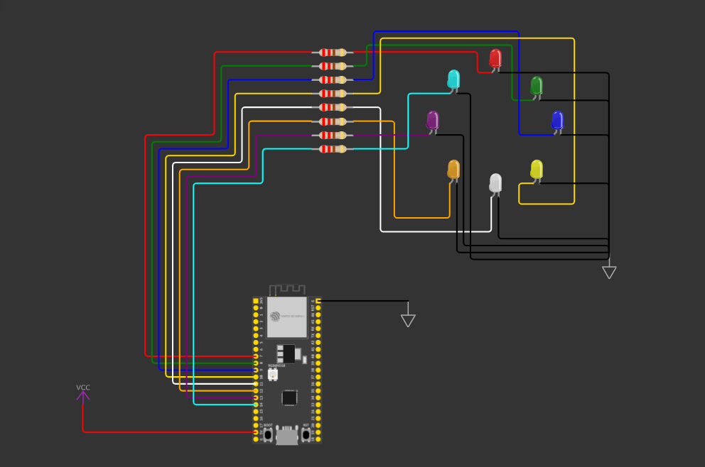

A simulação no Wokwi foi utilizada para verificar previamente a lógica de
acionamento correspondente às oito direções utilizando LEDs.

Os arquivos exportados da simulação e o link para a versão interativa estão
disponíveis em:

`documentacao/simulacoes/wokwi/`

### Simulação do atuador piezoelétrico no Proteus

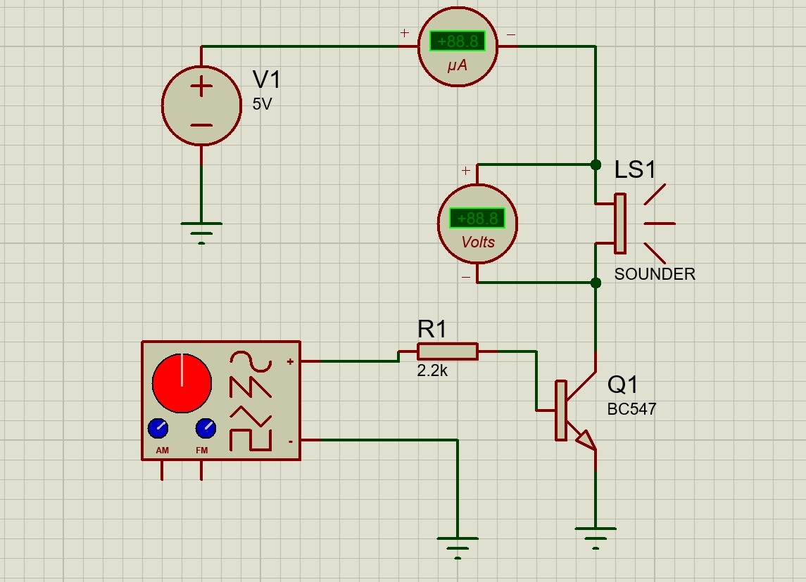

O Proteus foi utilizado durante uma etapa intermediária para representar e
avaliar o circuito de acionamento associado ao atuador piezoelétrico.

O arquivo do projeto e sua documentação estão disponíveis em:

`documentacao/simulacoes/proteus/`

## Validação da lógica direcional com LEDs

Após a etapa de simulação, a lógica das oito direções foi verificada em
montagem física com a ESP32 e LEDs.

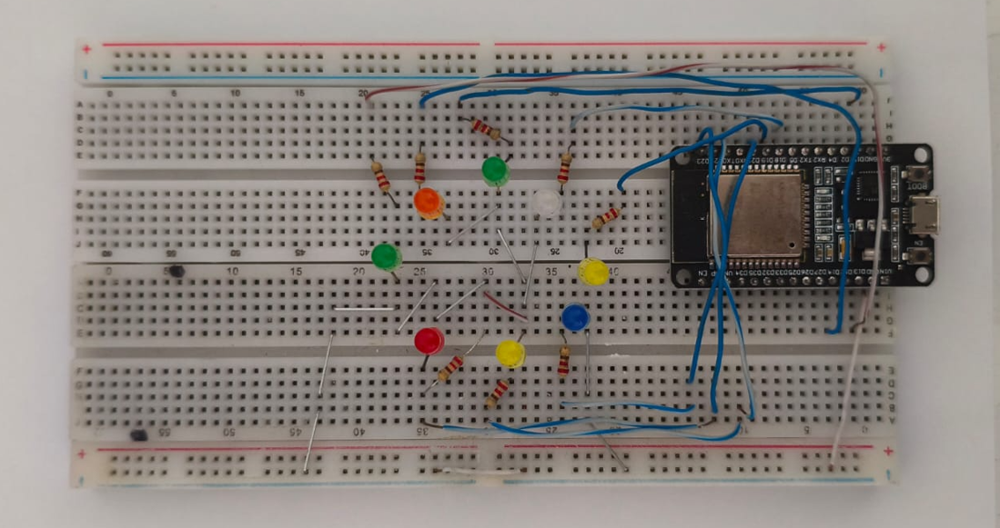

A montagem permitiu verificar o acionamento das saídas associadas às direções
e a integração entre o firmware e o hardware físico.

## Integração entre aplicativo e ESP32

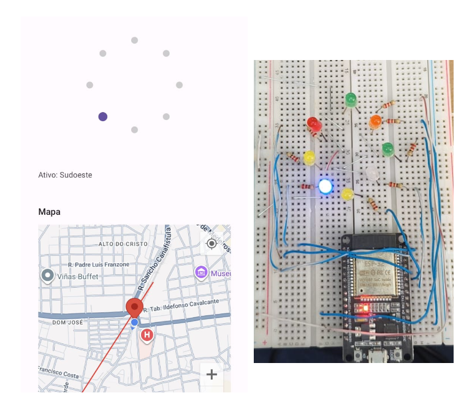

Nesta etapa, os comandos calculados pela aplicação foram enviados por BLE à
ESP32 e representados fisicamente pelos LEDs da montagem experimental.

## Avaliação do atuador piezoelétrico

O atuador piezoelétrico foi investigado como uma alternativa durante as etapas
intermediárias do desenvolvimento.

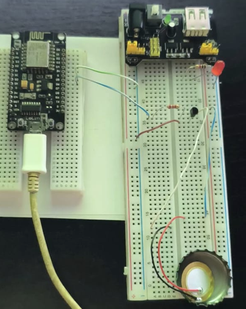

Os testes realizados nesta etapa contribuíram para a comparação exploratória
entre diferentes formas de geração de estímulo.

## Testes com motores vibratórios 1027

Posteriormente, foram realizados testes experimentais com motores vibratórios
1027, adotados como atuadores vibrotáteis nas etapas subsequentes da prova de
conceito.

### Montagens utilizadas

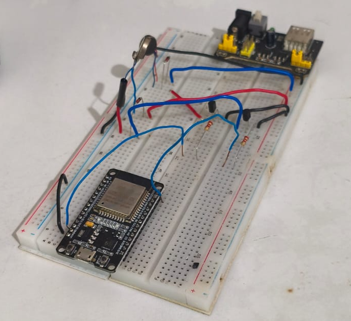

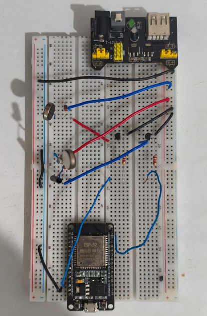

### Registros em movimento

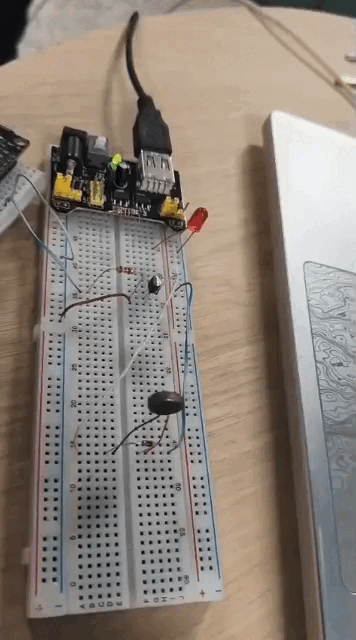

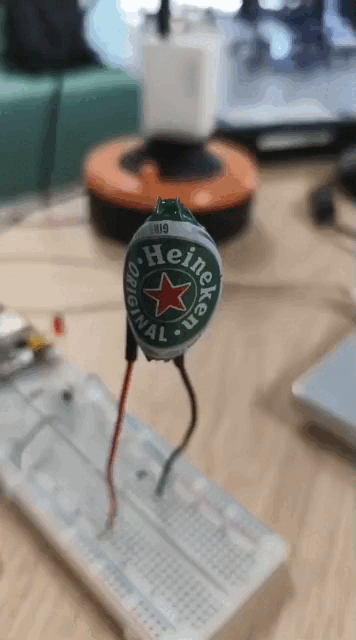

Os registros desta seção representam testes experimentais de bancada. A
configuração física completa contendo oito motores vibratórios simultâneos não
foi montada nem avaliada nesta etapa.

## Escopo do projeto

O sistema foi desenvolvido e avaliado tecnicamente como prova de conceito.

As validações realizadas permitiram verificar o funcionamento integrado entre
a aplicação Android, a comunicação BLE, a ESP32 e a lógica de acionamento,
além de testes experimentais com os atuadores.

A lógica das oito direções foi verificada com LEDs. Nos testes táteis foram
utilizados atuadores individualmente e, em algumas etapas, até dois motores
vibratórios simultaneamente.

A configuração física completa contendo oito motores vibratórios simultâneos e
a avaliação com usuários com deficiência visual não fizeram parte do escopo
experimental desta versão.

## Autor

**Frank William Araujo Souza**

Engenharia da Computação  
Universidade Federal do Ceará (UFC)

## Trabalho acadêmico

Código-fonte e documentação complementar disponibilizados como material de
apoio ao Trabalho de Conclusão de Curso sobre o desenvolvimento de um sistema
de navegação vibrotátil para pessoas com deficiência visual.
